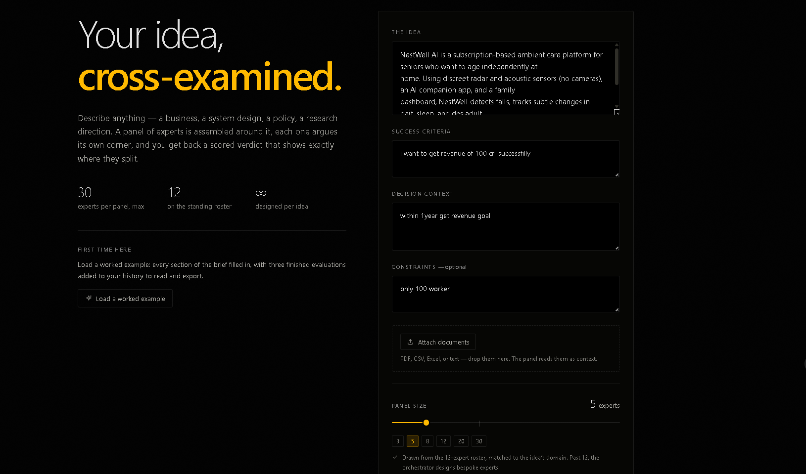
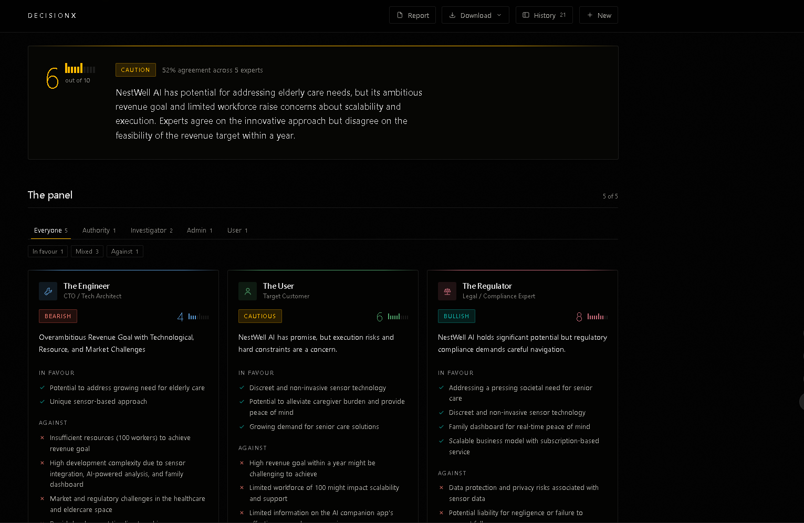

# DecisionX

DecisionX is a generalized, multi-agent idea evaluation platform. It allows you to input any business, technical, or creative idea and have it rigorously evaluated by a dynamically assembled panel of AI expert personas. 


*Main Screen UI - Dashboard*


*Result Page - Boardroom Verdict and individual expert cards*

## ✨ Features
- **Dynamic Persona Assembly**: Selects from 12 built-in experts (Investor, Engineer, Critic, etc.) or uses an LLM-driven "Panel Architect" to invent bespoke personas tailored specifically to your idea.
- **Parallel Execution**: Agents evaluate your idea simultaneously, outputting strict JSON verdicts, scores, and SWOT analyses.
- **Boardroom Synthesis**: A dedicated synthesizer agent compiles all expert opinions into a unified verdict, highlighting where experts agree and disagree.
- **Rich UI & NDJSON Streaming**: See the results stream in real-time. Review individual expert cards, boardroom scores, action plans, and data charts.
- **Local History & Exports**: Saves evaluations locally in your browser. Add reviewer notes and export results as standalone HTML or flat CSV.

## 🛠 Tech Stack
- **Frontend**: Next.js 16.3.0 (React 19), Tailwind CSS v4, DaisyUI, Framer Motion, Recharts.
- **Backend**: FastAPI (Python), Uvicorn.
- **LLM Integrations**: Dynamic provider chain supporting **Groq**, **NVIDIA**, and **OpenRouter** (with automatic fallback).

## 🔑 Setting up API Keys

The backend requires API keys to communicate with LLM providers. Groq is the primary provider due to its speed, with NVIDIA and OpenRouter as fallbacks.

1. Navigate to the `backend/` directory.
2. You will find text files for API keys: `groqapi`, `nvidiaapi`, and `openrouterapi`.
3. Open the file corresponding to your preferred provider (e.g., `groqapi`) and paste your API key inside. **Ensure there is only one key per file**. 
   - Alternatively, you can create a `.env` file in the `backend/` directory and set the keys there (refer to `.env.example`).
4. The system will automatically detect the available keys on startup and route requests accordingly.

## 🚀 How to Run Locally

We provide convenient scripts to start both the frontend and backend simultaneously.

**Prerequisites**: Ensure you have Node.js and Python installed.

**Windows**:
```cmd
start_dev.bat
```

**Unix / Linux / macOS**:
```bash
./start_dev.sh
```

These scripts will:
1. Stop any existing processes on ports 3000 and 8001.
2. Install necessary dependencies for both frontend and backend.
3. Start the FastAPI backend on `http://localhost:8001`.
4. Start the Next.js frontend on `http://localhost:3000`.

## 📖 How to Use

1. **Submit a Brief**: Open `http://localhost:3000`. Enter your idea in the main text area. You can also provide specific success criteria, constraints, and additional context.
2. **Attach Sources (Optional)**: Upload files (e.g., PDFs, Excel sheets, CSVs) to ground the evaluation in real data.
3. **Set Panel Size**: Choose how many experts you want on the panel (up to 30).
4. **Convene the Panel**: Click the button to start. The system will classify your idea, assemble the right experts (including custom ones if needed), and run their evaluations in parallel.
5. **Review Results**: Watch as the expert cards stream in. Once complete, review the synthesized executive summary, consensus points, and the actionable 7-day/30-day plan.
6. **Save & Export**: Use the sidebar (`Cmd/Ctrl + K`) to revisit past evaluations. You can also download the full report as an HTML document or CSV.
